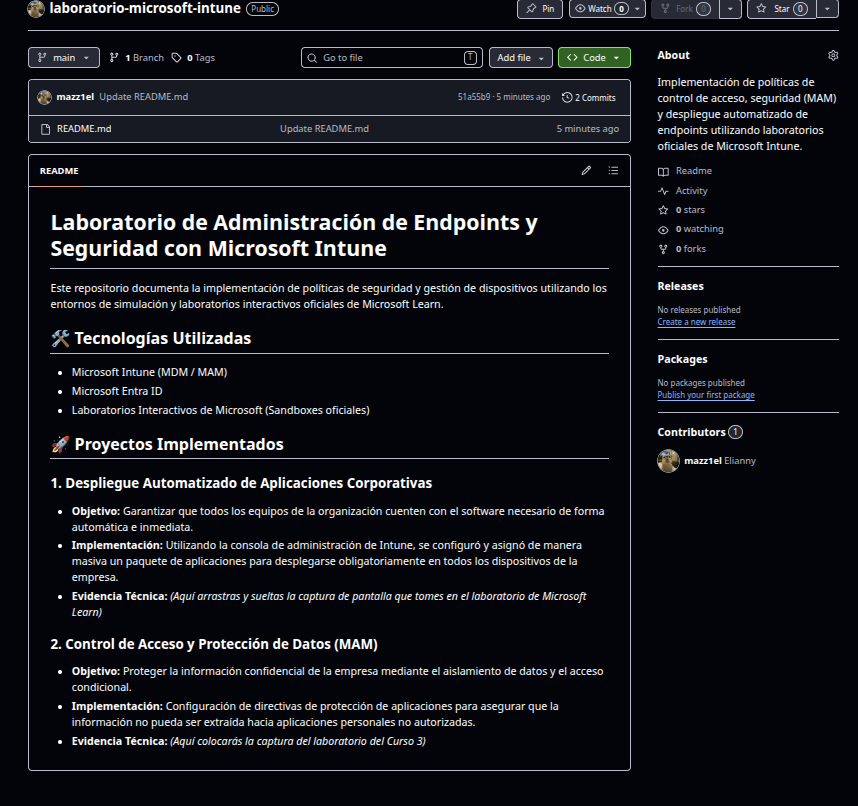

# Laboratorio de Administración de Endpoints y Seguridad con Microsoft Intune
 
Este repositorio documenta la implementación de políticas de seguridad y gestión de dispositivos utilizando los entornos de simulación y laboratorios interactivos oficiales de Microsoft Learn.
 
## 🛠️ Tecnologías Utilizadas
- Microsoft Intune (MDM / MAM)
- Microsoft Entra ID
- Laboratorios Interactivos de Microsoft (Sandboxes oficiales)
 
## 🚀 Proyectos Implementados
 
### 1. Despliegue Automatizado de Aplicaciones Corporativas
- **Objetivo:** Garantizar que todos los equipos de la organización cuenten con el software necesario de forma automática e inmediata.
- **Implementación:** Utilizando la consola de administración de Intune, se configuró y asignó de manera masiva un paquete de aplicaciones para desplegarse obligatoriamente en todos los dispositivos de la empresa.
- **Evidencia Técnica:**
  *(Aquí arrastras y sueltas la captura de pantalla que tomes en el laboratorio de Microsoft Learn)*
 
### 2. Control de Acceso y Protección de Datos (MAM)
- **Objetivo:** Proteger la información confidencial de la empresa mediante el aislamiento de datos y el acceso condicional.
- **Implementación:** Configuración de directivas de protección de aplicaciones para asegurar que la información no pueda ser extraída hacia aplicaciones personales no autorizadas.
- **Evidencia Técnica:**
  

